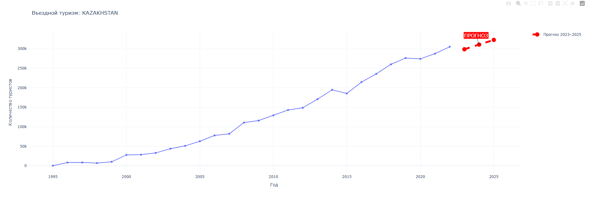
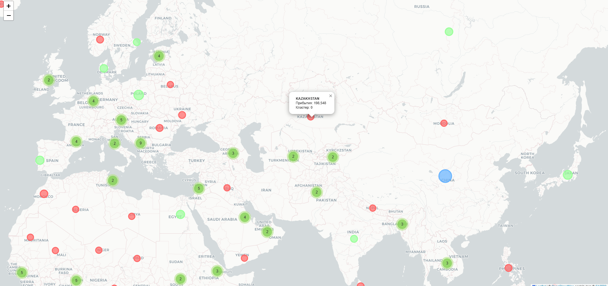

# Tourism Data Insights: Central Asia

Анализ туристических данных стран Центральной Азии на основе датасета UNWTO (Всемирная туристическая организация).

## 📊 Описание проекта

Проект предоставляет комплексный анализ данных о въездном и выездном туризме с 1995 по 2022 год, включая:
- Exploratory Data Analysis (EDA)
- Визуализации трендов и корреляций
- Прогнозирование туристических потоков (2023-2025)
- Кластеризацию стран по туристическим показателям
- Интерактивные дашборды и карты

## 🚀 Установка и запуск

1. Клонируйте репозиторий:
```bash
git clone https://github.com/NursultanMaulen/ai_essentials_final_project.git
cd ai_essentials_final_project
```

2. Создайте виртуальное окружение:
```bash
python -m venv venv
venv\Scripts\activate  # Windows
```

3. Установите зависимости:
```bash
pip install -r requirements.txt
```

4. Запустите программу:
```bash
python main.py
```

## 📋 Функционал

### 1. Загрузка данных
- Автоматическая загрузка датасета UNWTO через Kaggle API
- Анализ структуры данных и доступных метрик

### 2. EDA (Exploratory Data Analysis)
- Статистика по странам и временным периодам
- Анализ пропусков и выбросов
- Базовые метрики по странам Центральной Азии

### 3. Визуализации
- **Heatmap**: Корреляция типов туристических отчётов
- **Boxplot**: ТОП-30 стран по въездному туризму
- **Line Chart**: Динамика ТОП-15 стран + Центральная Азия (1995-2022)





### 4. Интерактивный дашборд
- Выбор страны из выпадающего списка
- Визуализация исторических данных
- Прогноз на 2023-2025 годы (Linear Regression)

### 5. Кластеризация + карта
- KMeans кластеризация стран по туристическим метрикам
- Интерактивная карта с маркерами (Folium)
- Экспорт результатов в CSV

### 6. Сравнение моделей
Сравнение 4 алгоритмов кластеризации:
- KMeans
- DBSCAN
- Agglomerative Clustering
- Gaussian Mixture Model (GMM)

Метрики: Silhouette Score, Davies-Bouldin Index, Calinski-Harabasz Index

## 🗂️ Структура проекта

```
ai_essentials_final_project/
├── main.py                          # Основной скрипт
├── requirements.txt                 # Зависимости
├── country_coords.csv               # Координаты стран
├── structured_UNWTO_tourism_data.csv # Датасет (загружается автоматически)
├── results/                         # Результаты визуализаций и карт
├── comparison/                      # Результаты сравнения моделей
├── img/                            # Скриншоты для README
│   ├── photo1.png
│   ├── photo2.png
│   └── photo3.png
└── README.md
```

## 🛠️ Технологии

- **Python 3.12**
- **Data Analysis**: pandas, numpy
- **Visualization**: matplotlib, seaborn, plotly
- **Machine Learning**: scikit-learn, scipy
- **Interactive**: ipywidgets, folium
- **Data Source**: kagglehub

## 📈 Результаты

Проект демонстрирует:
- Рост туристических потоков в Казахстане и Узбекистане после 2010 года
- Влияние COVID-19 на мировой туризм (2020-2021)
- Кластеры стран с различными туристическими профилями
- Прогнозы восстановления туризма до 2025 года

## 👤 Автор

**Nursultan Maulen**
- GitHub: [@NursultanMaulen](https://github.com/NursultanMaulen)

## 📄 Лицензия

Проект создан в рамках курса AI Essentials, 2025.